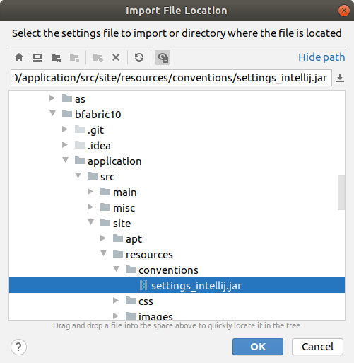
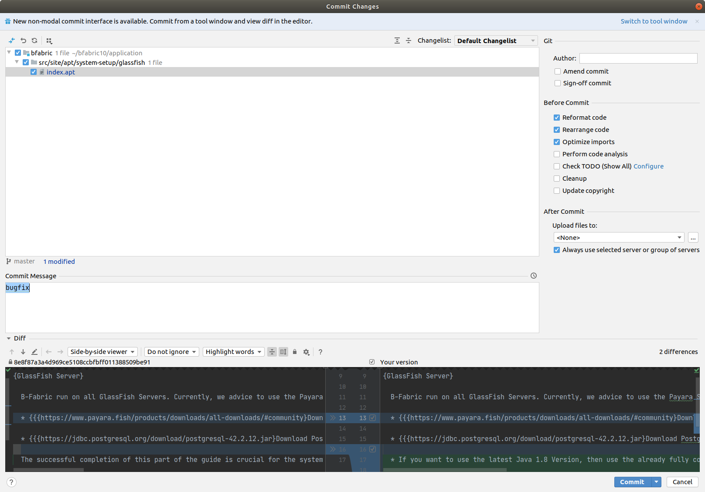

# B-Fabric Documentation

## Intellij IDE Setup

The same code formatting style has to be applied by all developers. Otherwise, it would almost be impossible to track code changes. In Intellij, import the settings_intellij.jar file that you will
find under $BFABRIC_CODE/application/src/site/resources/conventions. To do that, open on "File > Manage IDE Settings > Import
Settings ..."

To ensure that you always commit code that is formatted and rearranged as well as imports are optimized, checkmark the corresponding boxes in the before commit popup panel.

