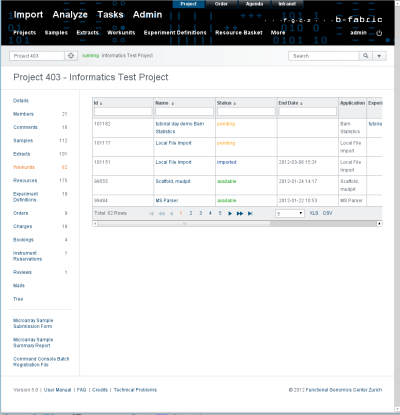
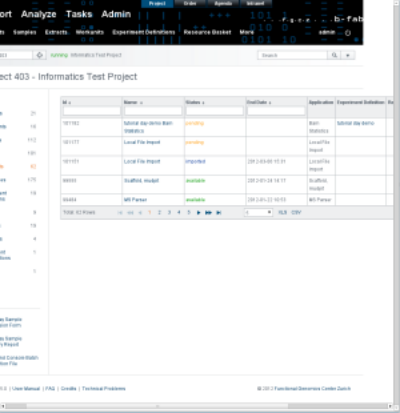

# B-Fabric — Oversize components

When a component becomes wider than the available page area (with a minimum page width of 1000px), the component itself should show a horizontal scrollbar instead of forcing the browser to create one and breaking the layout.

  


## Fixing oversize components

Add the CSS class `oversize` around content that may exceed the available width. Example (JSF):

```xml
<h:panelGroup styleClass="oversize">
  ... any content ...
</h:panelGroup>
```

## Open / Resize page in the browser

When opening (jQuery(document).ready()) or resizing (jQuery(window).resize()) a page in the browser are the mentioned methods in <src/main/webapp/js/jquery/jquery.custom.utils.js> executed. Look for
the comment <<<Oversize>>>:

  ```
  function fixOversize() {
    // Minimal page width 1000px
    var width, availableWidth = 1000, innerWidth = document.documentElement.clientWidth, activeElement = document.activeElement, element;
  
    if (availableWidth < innerWidth) {
      availableWidth = innerWidth;
    }
  
    jQuery("body").css("width", availableWidth + "px");
  
    jQuery(".ui-datatable-tablewrapper, .oversize").each(
        function() {
          try {
            // Important: reset width to auto to enforce its computation on the original component's width
            jQuery(this).css("width", "auto");
            // - 1 to be save in case of different rounding of browsers
            width = availableWidth - jQuery(this).position().left
                - jQuery("#contentBody").css("padding-right").replace("px", "") - 1;
            if (jQuery(this).width() > width) {
              jQuery(this).css("width", width + "px");
              jQuery(this).css("overflow-x", "auto");
            }
          } catch (err) {
            // not interested in this.
          }
        });
  
    if (activeElement != null && activeElement.id != null) {
      element = document.getElementById(activeElement.id);
      if (element != null) {
        element.blur();
        element.focus();
      }
    }
  }
  ```

For each element matching `.oversize` or `.ui-datatable-tablewrapper` the helper computes the maximum available width and applies it to the element. If the inner content would exceed that width, the helper sets `overflow-x: auto` so the element shows a horizontal scrollbar instead of forcing a page-level scrollbar.

## Render a partial (AJAX) page fragment

When a page fragment is updated via AJAX, the global open/resize handlers do not run automatically. Trigger the width computation manually by calling `fixOversize()` from `src/main/webapp/js/jquery/jquery.custom.utils.js` after the fragment update. The most common approach is to use the `oncomplete` attribute of the updating component. Example:

```xml
<p:commandButton
  value="#{messages.save}"
  action="#{chargesManager.saveNewCharges()}"
  oncomplete="fixOversize();"
  styleClass="select"
  update="edit-charges-table, charges-list" />
  ```

Calling fixOversize() after the update ensures the new content receives the correct maximum width and, if needed, a horizontal scrollbar.

## Render datatables

The datatable.xhtml fragment already calls fixOversize() automatically. Tables rendered via datatable.xhtml do not require additional manual handling for oversize cases.