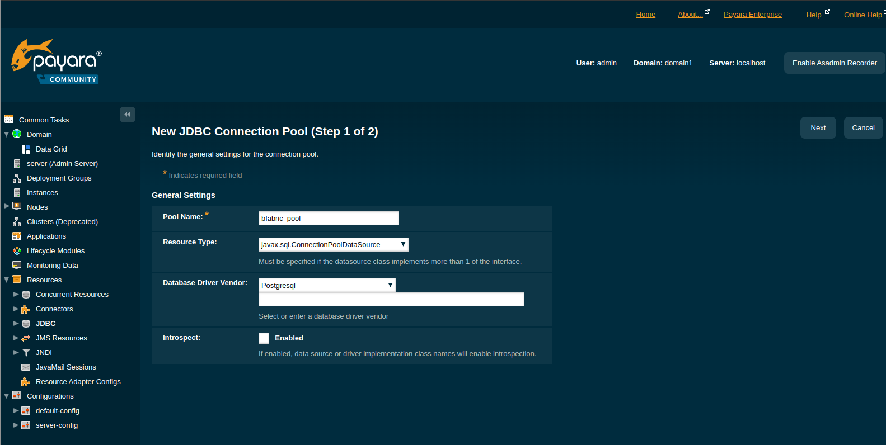
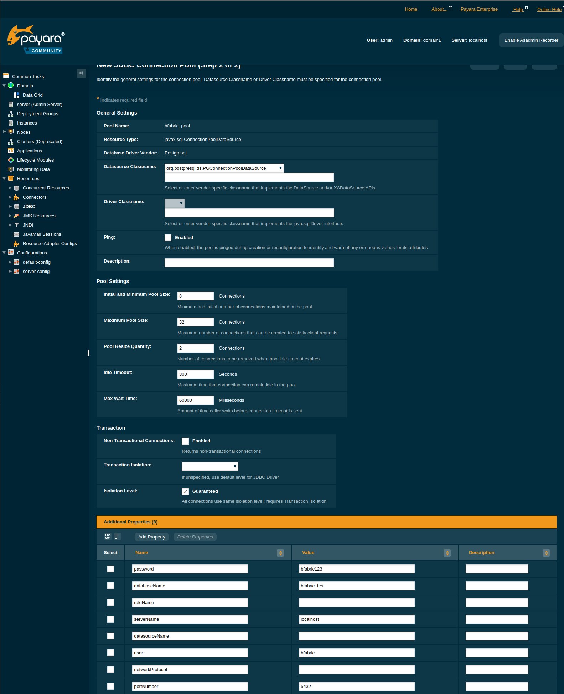
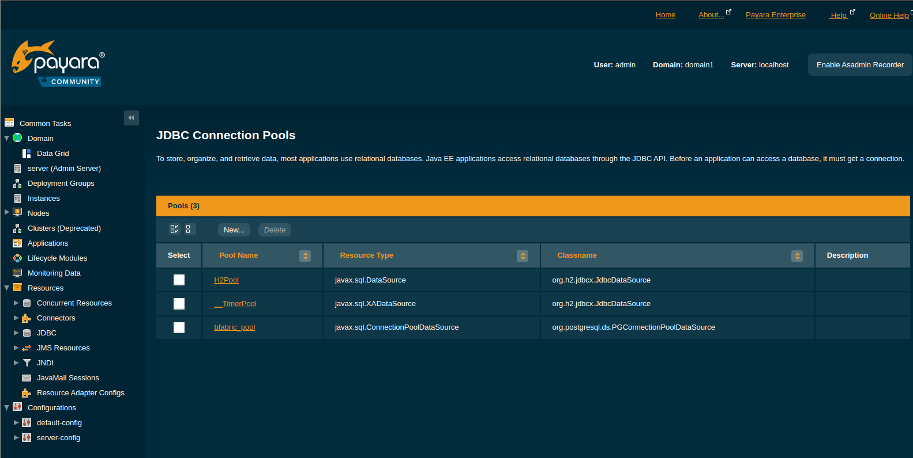
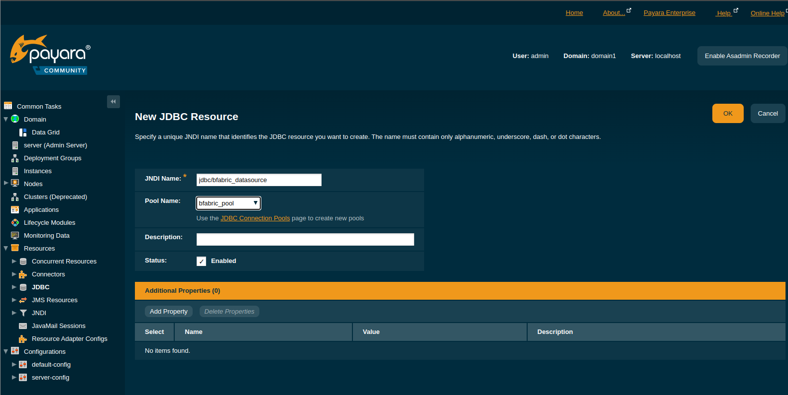
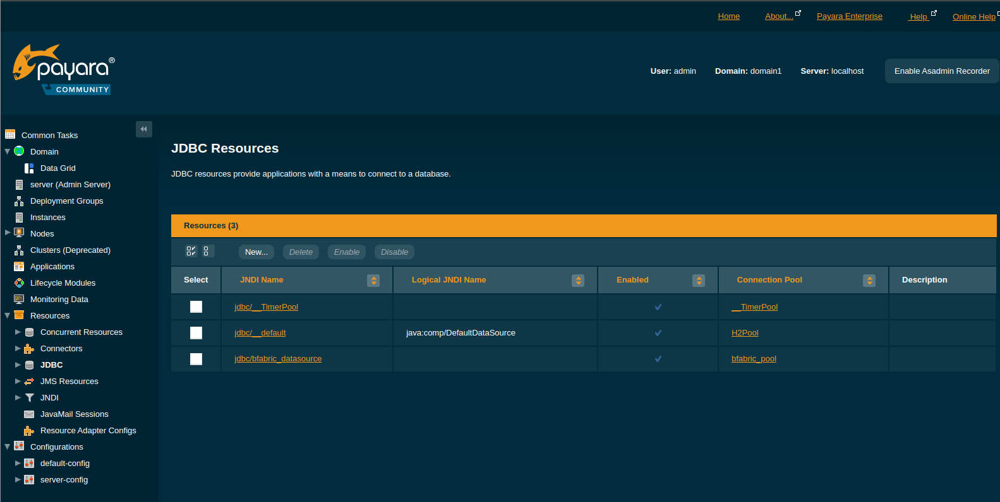

# B-Fabric Documentation

## GlassFish Server: Database Access Configuration

Navigate to Resources → JDBC → Connection Pools, and click on the "New" Button.

The screen "New JDBC Connection Pool (Step 1 of 2)" appears. Set the values as shown in the following picture. When you are done, click on the "Next" button.



The screen "New JDBC Connection Pool (Step 2 of 2)" appears. Click on This screen consists of sections "General Settings, Pool Settings, and Transaction". You need to edit the "Transaction" section,
by setting the parameters according to the own environment. The following figure actually show the parameters to be set. After you are done, click on the "Finish" button.

HINT: Set datasource classname to org.postgresql.ds.PGConnectionPoolDataSource





Navigate to Resources → JDBC → JDBC Resources. Click on the "New" button in the Resources table.

Enter the parameters as shown in the following figure and click on "OK".



Navigate to Resources → JDBC → JDBC Resources. If you see an entry with the name "jdbc/bfabric_datasource", then you are finished with this section.



### Troubleshooting

If you get an error message when trying to ping the database, then you could check following points.

* Are all parameters entered correctly?

* Is it possible to get a database connection with the parameters provided?

* Edit JDBC Connection Pool Properties → Additional Properties: Set assumeMinServerVersion=9.0 to get rid of the undesired PG_LOG entries "SET extra_float_digits = 3"

```
bfabric@bfabric-host:~$ psql -U bfabric -d bfabric_test -h localhost -p 5432
```

Did you copy the postgres driver into $GLASSFISH_HOME/lib before starting the GlassFish server? Restart the server to be sure that this is not the problem.

```
bfabric@bfabric-host:~/glassfish/bin$ ./asadmin stop-domain domain1 && ./asadmin start-domain domain1
```

