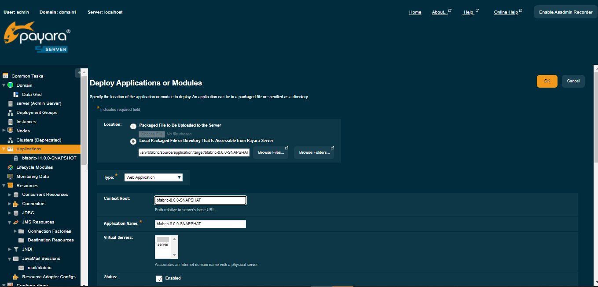
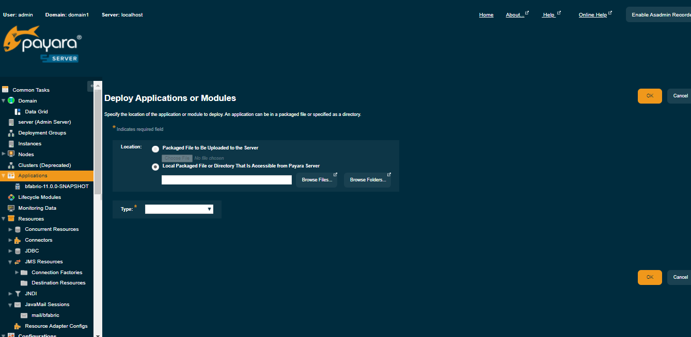
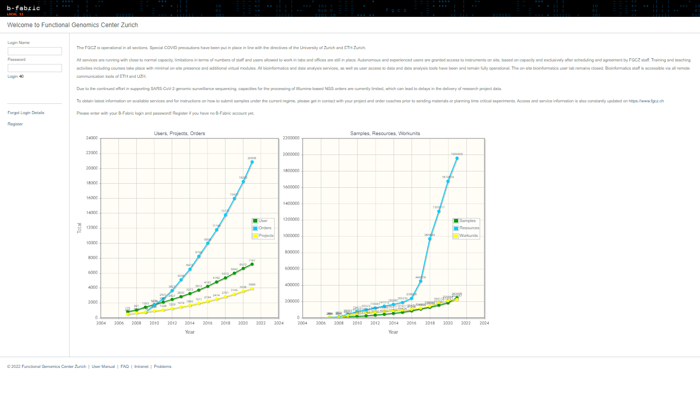

# B-Fabric Documentation

## GlassFish Server: B-Fabric Deployment

Deployment installs the B-Fabric web application into GlassFish. The application archive is created at `\$BFABRIC_CODE/application/target/bfabric-13.0.0-SNAPSHOT.war`. Maven install replaces this WAR file.

```
bfabric@bfabric-host:~$ cd $BFABRIC_CODE && mvn clean install && cd application/ && mvn clean install && cd $HOME
```

There are two ways to deploy B-Fabric Web Application: using the Web interface or the command line tool "asadmin".

#### Deploying B-Fabric through the Web Interface

* Start the GlassFish server.

```
bfabric@bfabric-host:~$ cd $GLASSFISH_HOME/bin
bfabric@bfabric-host:~/glassfish/bin$ ./asadmin start-domain domain1
```

* Navigate to the GlassFish Web Console (likely http://localhost:4848/) and login.

* Navigate to Applications → Web Applications. Click on the "Deploy..." Button in the "Deployed Web Applications" table.

* The "Deploy Enterprise Applications/Modules" page shows, as shown in the following figure.



* Chose "Web Application (.war)" parameter for Type.

* Chose "Local packaged file or directory that is accessible from the Application Server" and click on "Browse Files". Navigate to your $BFABRIC_CODE/application/target/, select the
  bfabric-13.0.0-SNAPSHOT.war file and click on "Choose File".

* Set the value of the option "Application Name" to bfabric.

* Set the value of the option "Context Root" to bfabric.



* Click on the "OK" button.

* B-Fabric is being deployed now. It is recommended to observe the log file. The deployment should take between one and two minutes.

* Finally, open http://localhost:8080/bfabric/. If the screen is loaded as shown in the following figure, then you are done.



#### Deploying B-Fabric through the Command Line

* Create the file $BFABRIC_CONF/pwd.txt file with the following content (this is the admin password for the GlassFish server instance).

```
AS_ADMIN_PASSWORD=adminadmin
```

* Start the GlassFish server.

```
bfabric@bfabric-host:~$ $GLASSFISH_HOME/bin/asadmin start-domain domain1
```

* Deploy B-Fabric.

```
bfabric@bfabric-host:~$ $GLASSFISH_HOME/bin/asadmin deploy --force=true --user admin --passwordfile $BFABRIC_CONF/pwd.txt --contextroot bfabric $BFABRIC_CODE/application/target/bfabric-13.0.0-SNAPSHOT.war
```

* It takes between one and two minutes for deploying, dependent on your hardware. Finally, open http://localhost:8080/bfabric/ (adapt the host according to your configuration).   