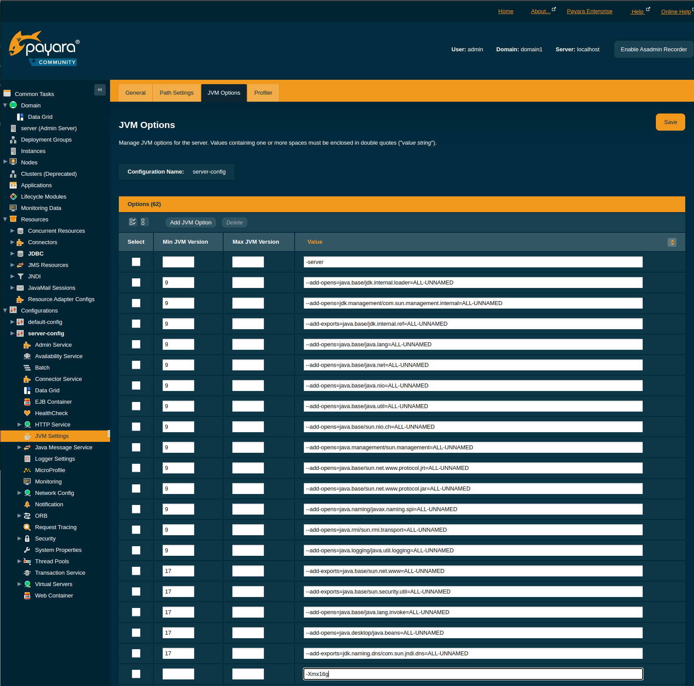
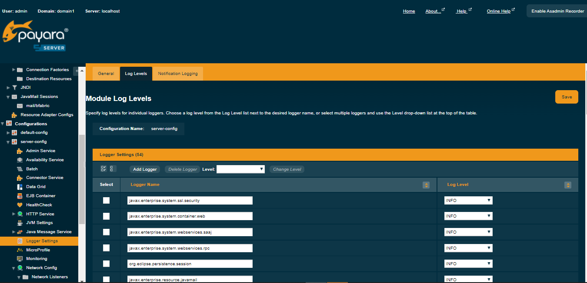

# B-Fabric Documentation

## GlassFish Server: JVM Options

To edit GlassFish JVM options, open the admin console and go to `Configurations` → `server-config` → `JVM Settings` → `JVM Options`. Remove any duplicate entries (each option must appear only once), add or update the required JVM options, and then click the `Save` button.


```
-Xmx8g
-Djava.awt.headless=true
```



Open the GlassFish admin console, go to Configurations → server-config → Logger Settings, and add the following entry to disable the web services logger:

```
javax.enterprise.system.core.security.com.sun.enterprise.security.webservices OFF
```



Note: In earlier versions, SOAP fault stack traces for web services were disabled by setting the JVM system property 

`-Dcom.sun.xml.ws.fault.SOAPFaultBuilder.disableCaptureStackTrace=false`.

```
-Dcom.sun.xml.ws.fault.SOAPFaultBuilder.disableCaptureStackTrace    false
```