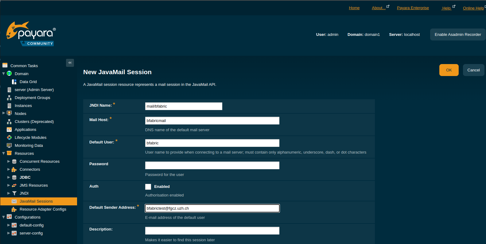
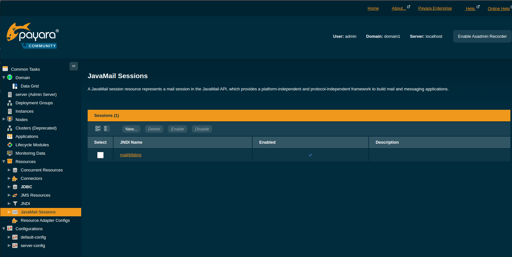

# B-Fabric Documentation

## GlassFish Server: Mail Server Configuration

`Prerequisite`: You have successfully completed the /system-setup/postfix.html Postfix Mail Client installation.

Navigate to Resources → JavaMail Sessions, then click on "New..." button.

The screen "New JavaMail Session" appears. Enter the parameters as shown in the following figure and click on "Save".

There are no test possibilities from within GlassFish Web Console to test this.