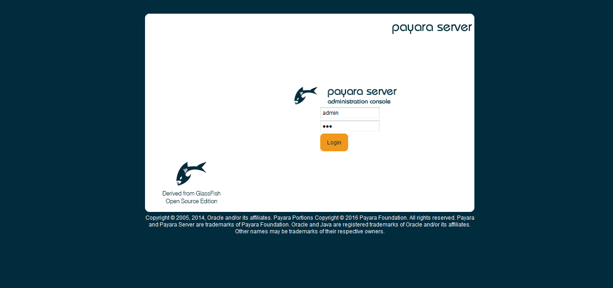
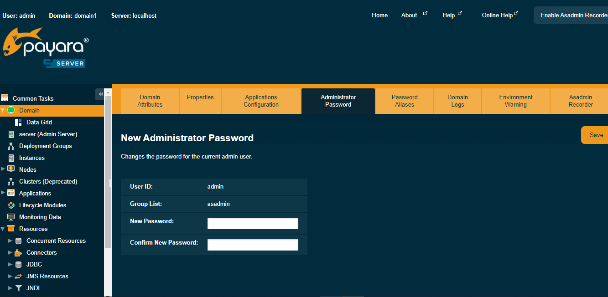

# B-Fabric Documentation

## GlassFish Server: Server Startup

* Start the GlassFish server. Server logs are written to `\$GLASSFISH_HOME/domains/domain1/logs/server.log`.
```
bfabric@bfabric-host:~/glassfish/bin$ ./asadmin start-domain domain1
```

* In a web browser, go to `http://yourhost:4848/` to open the GlassFish admin console.



* Sign in with username `admin` and password `adminadmin`. If prompted to register, you may skip it. To change the administrator password, go to Common Tasks → Change Administrator Password.

