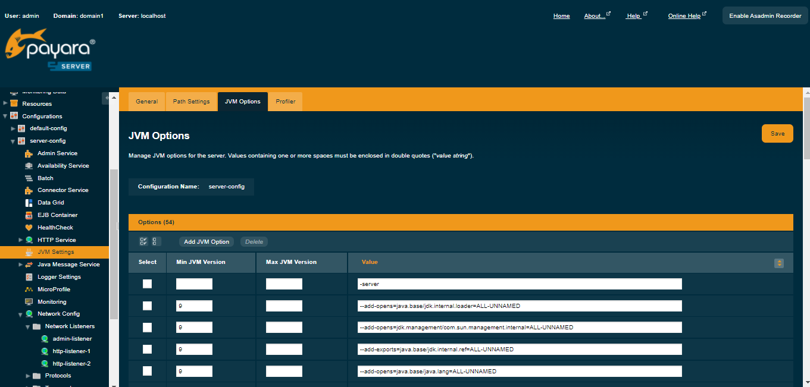

# B-Fabric Documentation

## GlassFish tuning

GlassFish: HTTP GZip compression and proxy settings
* Enable GZip compression for HTTP responses.

* Set `Compressible Mime Types` to:
`text/plain, text/css, text/html, text/javascript, application/javascript, application/x-javascript, application/json, application/xml, application/rss+xml, image/svg+xml, image/x-icon`

* Set `compression-min-size-bytes` to `200` so responses smaller than 200 bytes are not compressed.

* Add the `-server` JVM option to GlassFish JVM options for improved server performance.

* When GlassFish runs behind a proxy, configure the scheme mapping so the server detects the original request scheme. Set:
`server.network-config.protocols.protocol.http-listener-1.http.scheme-mapping = X-Forwarded-Proto`

 GlassFish GZip compression for HTTP.

 GlassFish '-server' JVMSettings/JVMOptions.

See also http://download.oracle.com/javase/7/docs/technotes/tools/windows/java.html#standard

