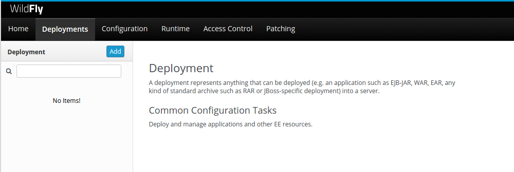
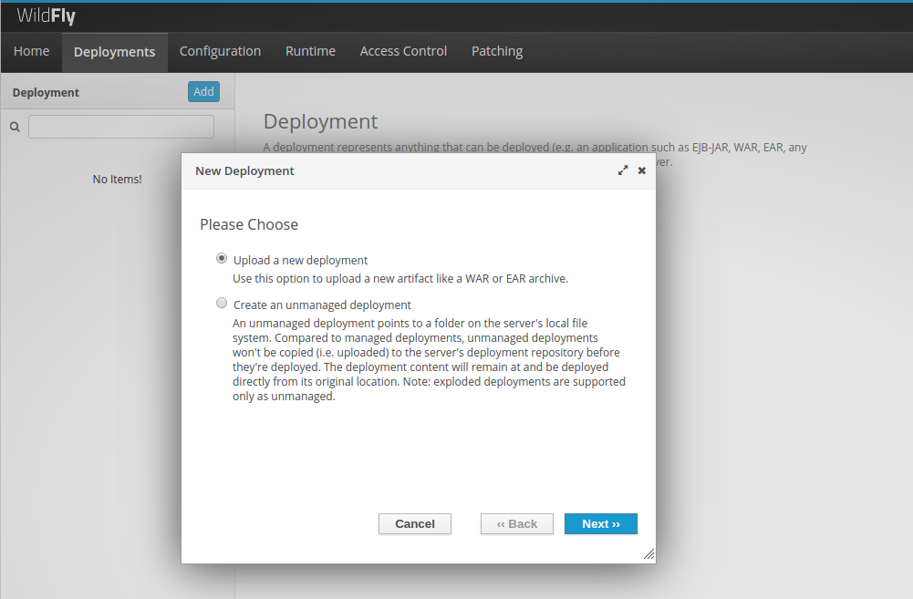
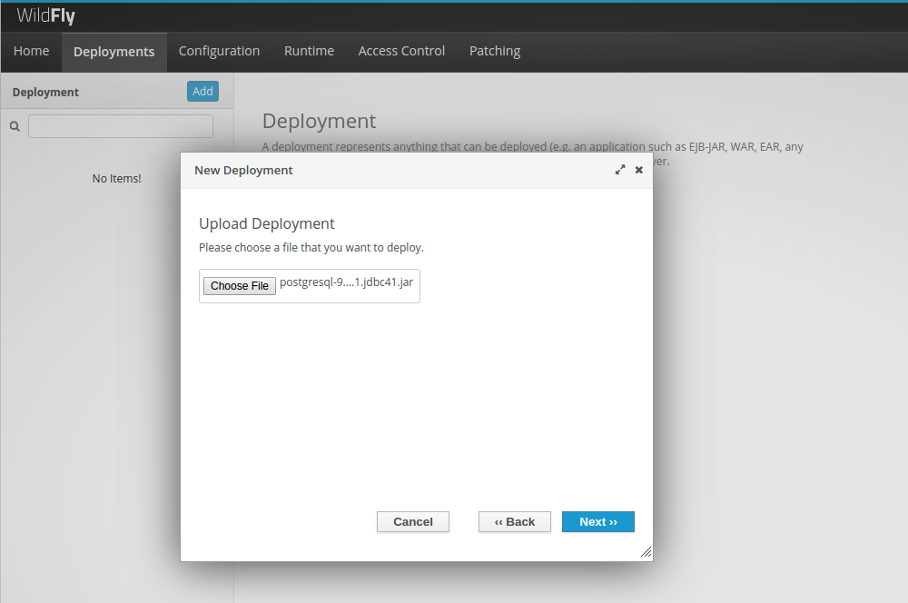
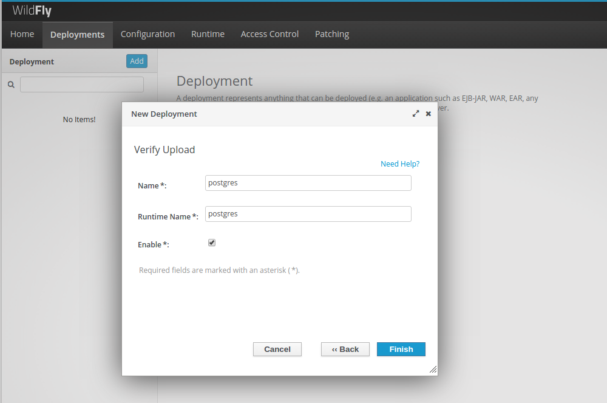
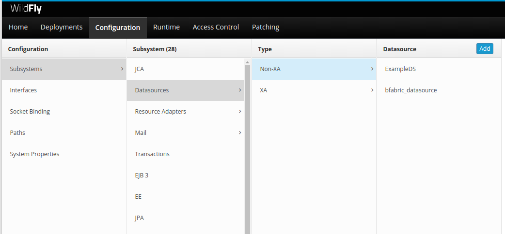
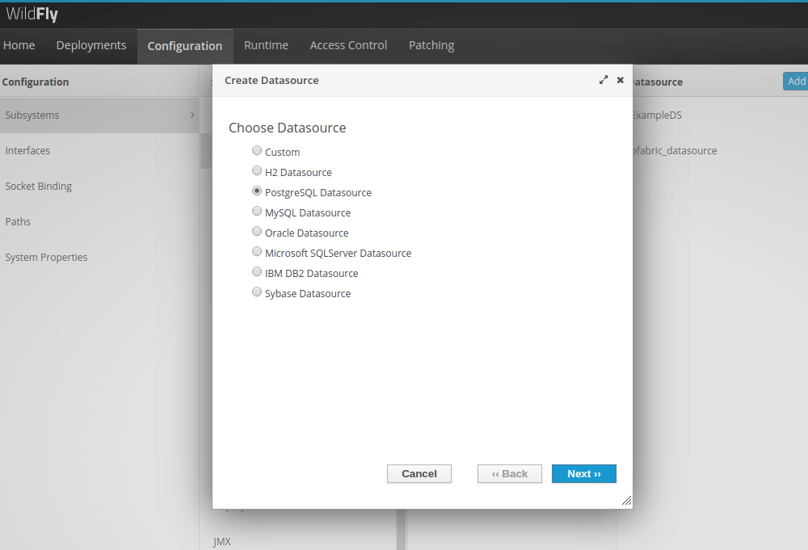
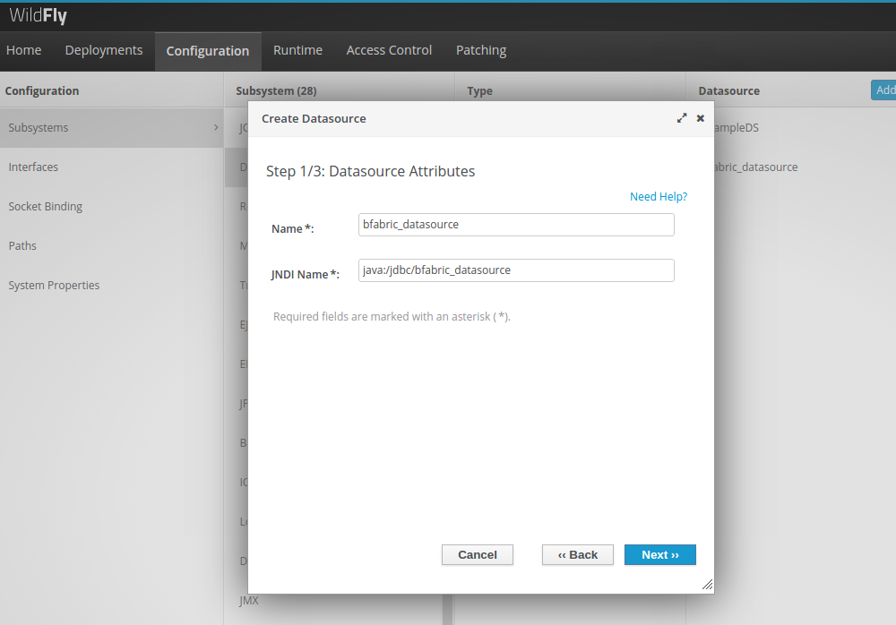
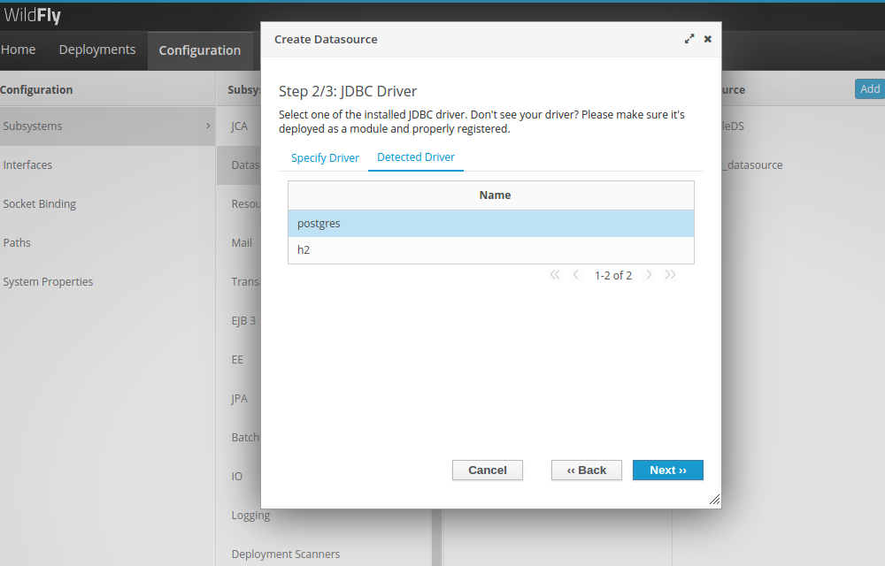
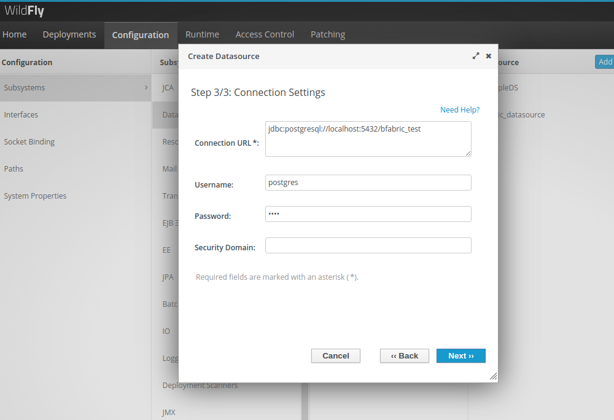
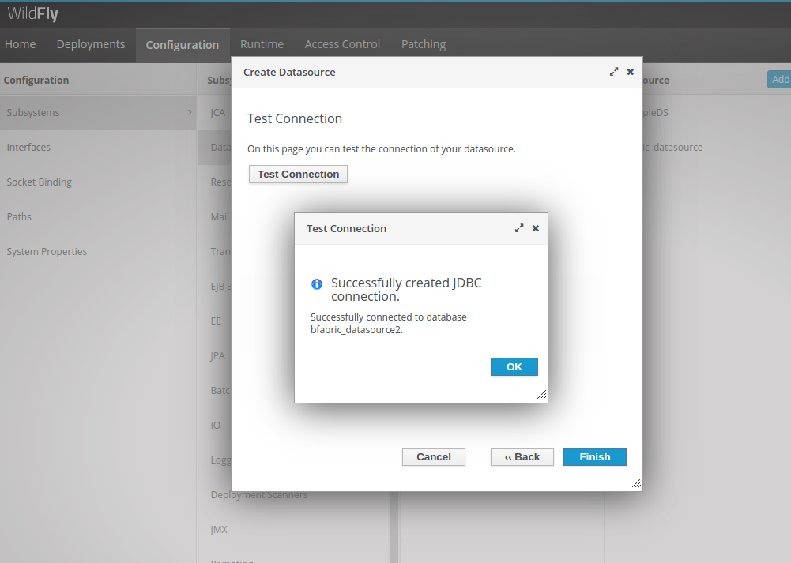

# B-Fabric Documentation

## Wildfly Server: Database Access Configuration

Navigate to Deployments and click on "Add" Button.

Select "Upload a new deployment" and click "Next".

Choose the PostgreSql Driver file (eg: postgresql-9.4-1201.jdbc41.jar), and click "Next".

Change the name and runtime name into "postgres" and click "Finish".

Navigate to Configuration → Subsystems → Datasources → Non-XA

Click on the "Add" button to add a new datasource.

Choose "PostgreSQL Datasource" and click next.

Fill up the name and JNDI name with "bfabric_datasource" and "java:/jdbc/bfabric_datasource" respectively. Click next.

In the JDBC Driver section click on "Detected Driver" and choose "postgres" from the list of already deployed drivers. Click next.

Fill out the database name in the Connection URL (eg: bfabric_test) and then a valid username and password for the database access.

Before Finish, click on "Test Connection" to check if all data was introduced correctly.

