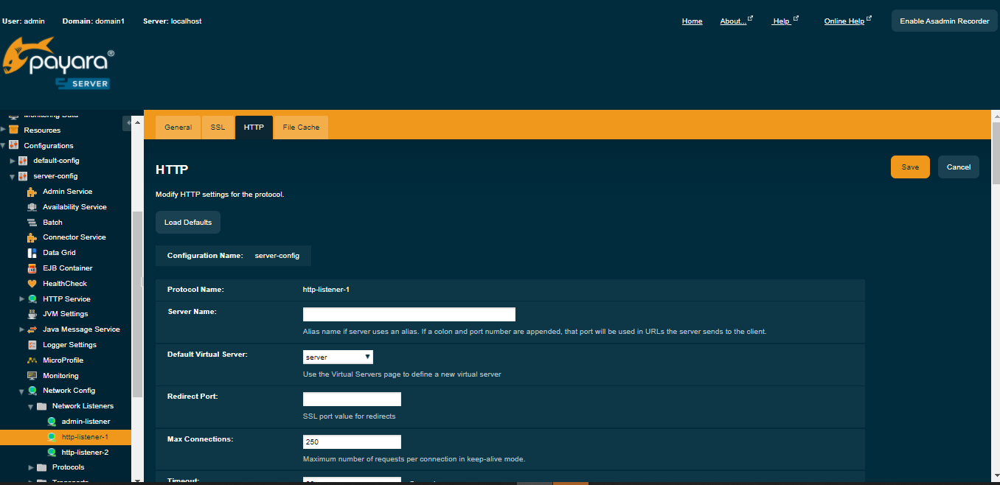

# B-Fabric Documentation

## Wildfly Server: Server Startup

* Start the Wildfly server.

```
bfabric@bfabric-host:~/wildfly/bin$ ./standalone.sh
```

* Open a web browser and navigate to the Wildfly login page (http://yourhost:9990). The login screen should appear as shown in the following picture.



* Log in as user "admin", password "admin".